# WeissWein: German Search Engine & Quiz Tool

A minimalist, self-hosted **web application** for searching German words, practicing vocabulary, and playing interactive quizzes — powered by [PONS](https://en.pons.com/), [Verbformen](https://www.verbformen.de/), and [Reverso](https://context.reverso.net/).

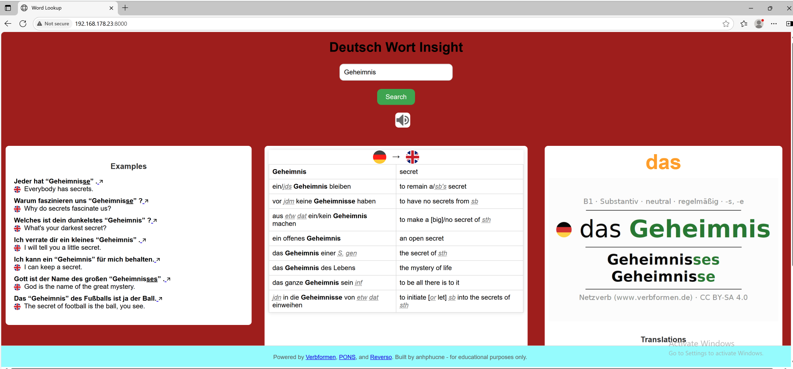

---

## 🚀 Features

* 🔍 Word search with API fallback and local caching (SQLite)
* 🗣️ Audio pronunciation for German words
* ✍️ Dictation mode with sentence segmentation (In Developement)
* 📚 Quiz game: tap-to-order style 
* 📤 CSV Import of custom word sets
* 📈 Stats tracking by date
* 🛠 Runs with Docker or directly using FastAPI

---

## Screenshots

| Screen.             | Mode 1 | Mode 2 | Mode 3 |
| ------------------- | -------- | -------- | -------- |
| Dictionary (Including Verb conjugation) |  | 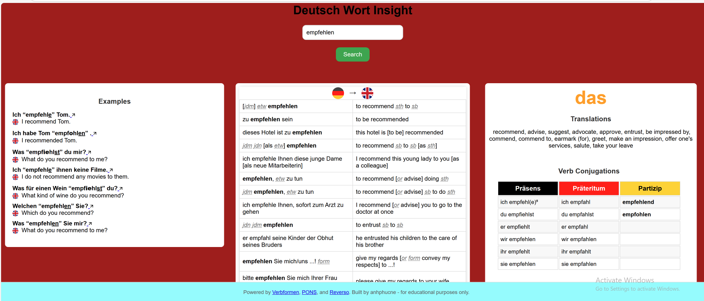 |  |
| Quiz - Puzzel | 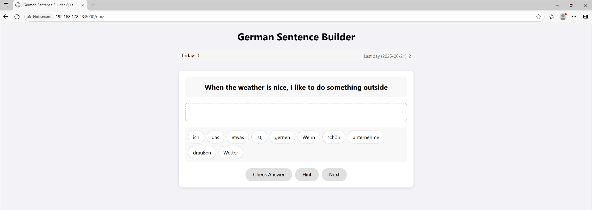 | 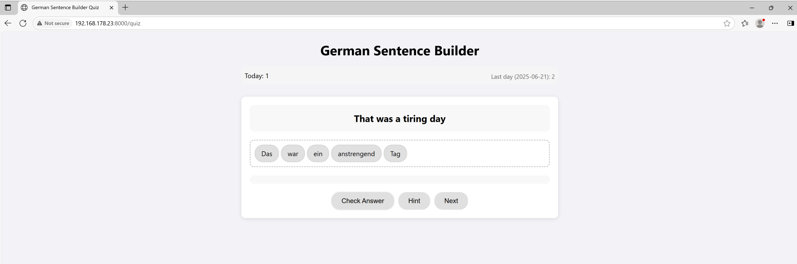 | 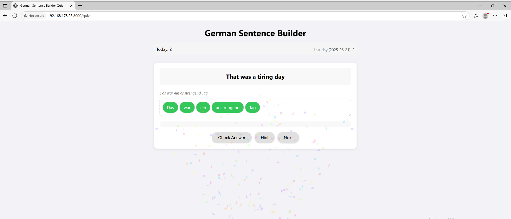 |
| Quiz - Verb | 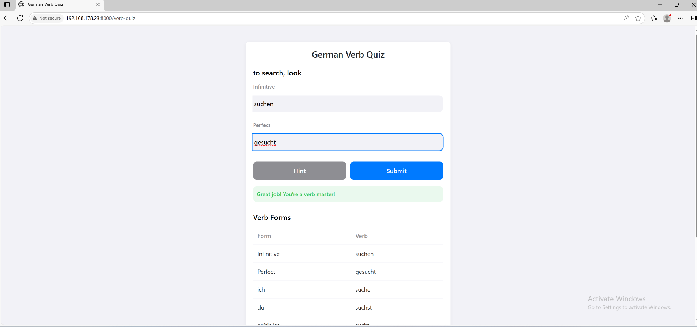 | 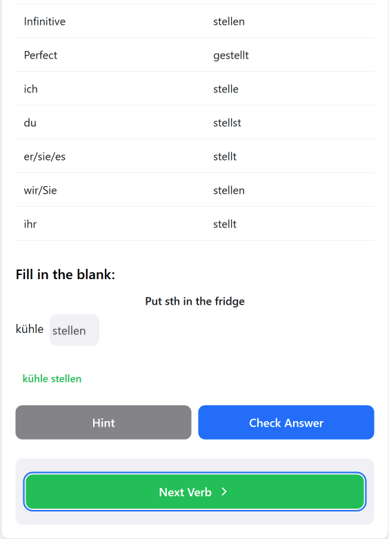 | 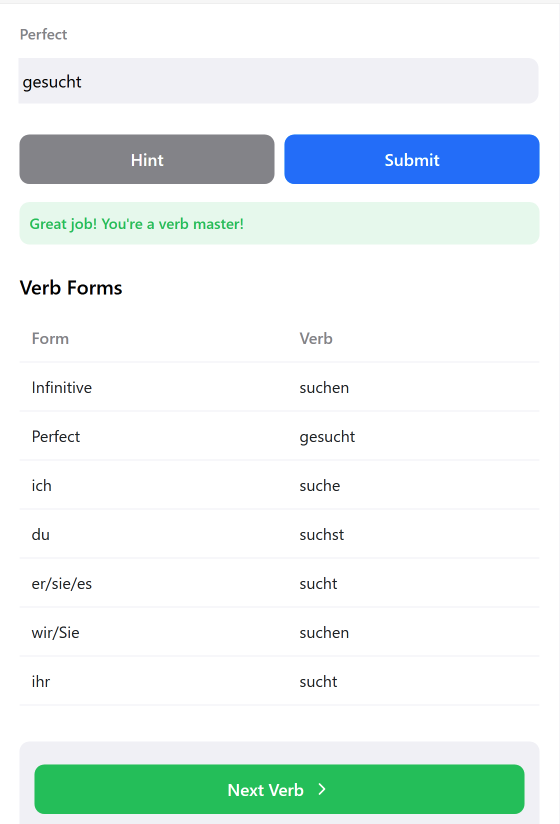 |
| Quiz - Noun (Article) | 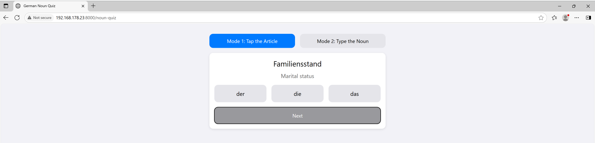 | 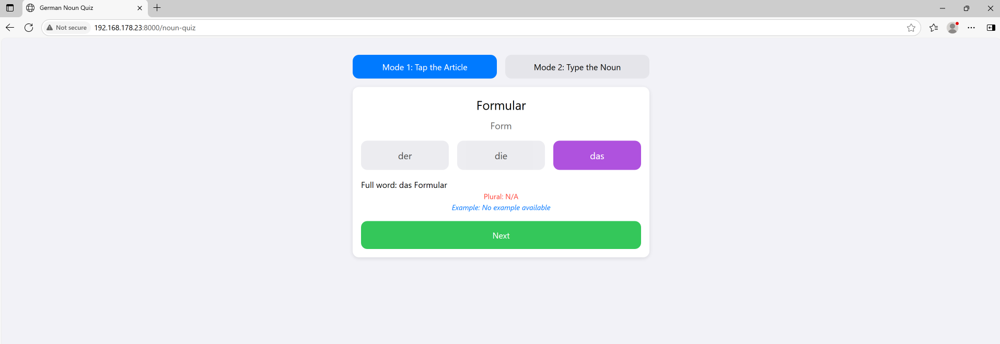 |  |
| Quiz - Noun (Full word)| 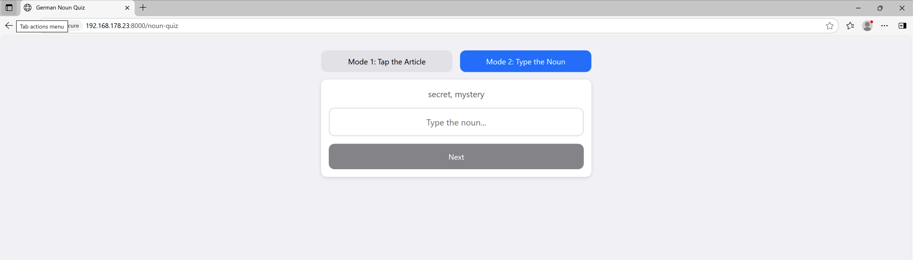 | 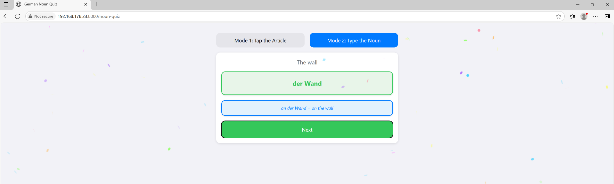 | 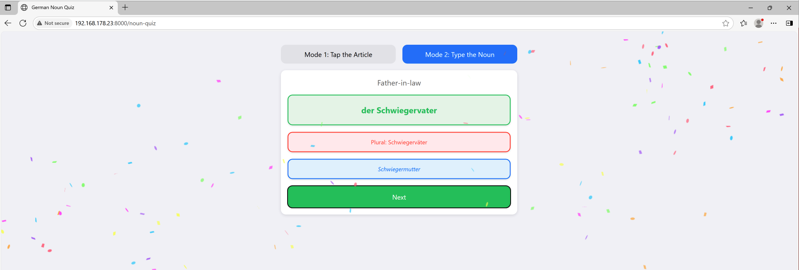 |
---

## 🛠️ Getting Started

### 📦 Requirements

* Python 3.10+
* Docker (optional)

### 🔧 Local Run

```bash
git clone https://github.com/yourname/weisswein_searchengine.git
cd weisswein_searchengine
pip install -r requirements.txt
uvicorn app.main:app --host 0.0.0.0 --port 8000
```

### 🐳 Docker Run

```bash
docker-compose build
docker-compose up
```

Then open `http://<your-local-ip>:8000` in your browser.

---

## 🔄 Folder Structure

```
app/
├── data/               # SQLite cache for searches
├── static/             # CSS, icons
├── templates/          # Jinja2 templates
├── scripts/            # audio segmentation and tools
└── main.py             # FastAPI app
```

---

## 📥 Customization

* Add your own CSV files into `app/data/`
* Configure `.env` for API keys (OpenAI, PONS, etc.)
* Adjust UI templates in `templates/`

---

## 🤝 Credits

* [Verbformen.de](https://www.verbformen.de/)
* [PONS](https://en.pons.com/)
* [Reverso](https://context.reverso.net)
* [FastAPI](https://fastapi.tiangolo.com/)
* [SQLite](https://sqlite.org/)

---

## 📜 License

MIT License

> Created by anhphucne — for personal and educational use.
